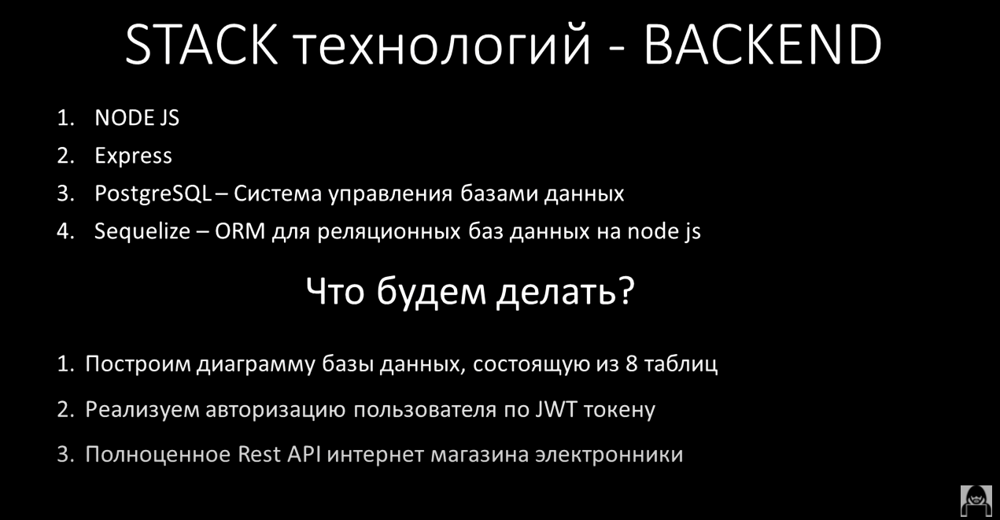
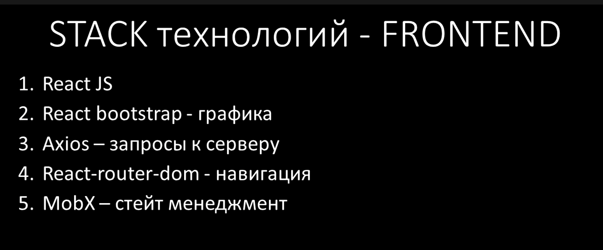

### React & Node.js ИНТЕРНЕТ МАГАЗИН С НУЛЯ. PERN stack PostgreSQL + express + React js + node.js
##  [Ulbi TV](https://www.youtube.com/channel/UCDzGdB9TTgFm8jRXn1tBdoA)
##  [This project youtube link](https://www.youtube.com/watch?v=H2GCkRF9eko)


## Overview




##### in resources have figma file

## Development

### Installation

Requires 
- [Node.js](https://nodejs.org/) 
###SERVER
1) Copy abd rename file env.example to .env
2) Insert data in .env file

Install the dependencies and devDependencies and start the server.

```sh
cd ./src/server
npm i
npm run dev
```


##CLIENT
1) Copy abd rename file env.example to .env
2) Insert data in .env file

Install the dependencies and devDependencies and start the server.


```sh
cd ./src/client
npm i
npm run start
```


# License

MIT

**Free Software**


